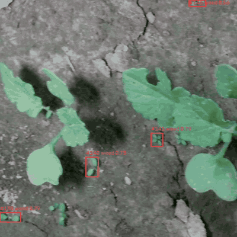
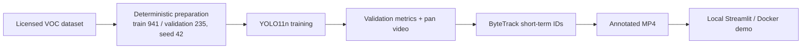

# Weed Detection and Short-Term Tracking

[](https://github.com/BLHmarwane/realtime-weed-tracking/actions/workflows/smoke-tests.yml)

Fine-tuned YOLO11n crop/weed detection with ByteTrack short-term track IDs,
measured on video and packaged as a local Streamlit + Docker demo.



| Validation mAP@50 | CPU video pipeline | Apple MPS video pipeline | Test suite |
|---:|---:|---:|---:|
| [**0.802**](metrics/baseline.json) | [**15.3 FPS**](metrics/tracking_cpu.json) | [**28.1 FPS**](metrics/tracking.json) | **47 automated tests** |

This repository turns an agricultural vision dataset into a reproducible
end-to-end case study: training, validation, temporal association, and a local
product-style demo. My broader C++ portfolio also includes
[ManualRegistrationGL_V2](https://github.com/BLHmarwane/ManualRegistrationGL_V2),
a separate Qt6/OpenGL manual 3D registration simulator for medico-surgical
interaction research.



## Results and protocol

Dataset preparation converts Pascal VOC annotations into YOLO labels, maps the
source species to `crop` and `weed`, then creates a deterministic 941-image
train / 235-image validation split with seed 42. Detection scores are archived
in [`baseline.json`](metrics/baseline.json) and
[`baseline_cpu.json`](metrics/baseline_cpu.json).

| Metric | Overall | Crop | Weed |
|---|---:|---:|---:|
| mAP@50 | 0.8024 | 0.7926 | 0.8122 |
| mAP@50:95 | 0.5221 | 0.5217 | 0.5224 |

Video throughput covers detection, ByteTrack association, annotation, and MP4
writing on a 600-frame clip with a 25 FPS source. Both measurements were made
on Darwin arm64 and are archived with their protocol.

| Device | Pipeline FPS | Evidence |
|---|---:|---|
| CPU | 15.30 | [`tracking_cpu.json`](metrics/tracking_cpu.json) |
| Apple MPS | 28.12 | [`tracking.json`](metrics/tracking.json) |

CPU falls below the 25 FPS source rate, while Apple MPS exceeds it on this
single synthetic-motion clip.

## Scope and limitations

- Detection quality is reported on the validation split, not an independent
  test split.
- The 600-frame tracking clip is a deterministic pan created from validation
  images, not a field video.
- No MOT ground truth is available, so no IDF1, HOTA, MOTA, or fragmentation
  metric is reported.
- ByteTrack provides short-term track IDs across nearby frames, not persistent
  biological identity.
- The Streamlit demo runs locally; no hosted service is provided.

## Quickstart

### Local

```bash
git clone https://github.com/BLHmarwane/realtime-weed-tracking.git
cd realtime-weed-tracking
python3.12 -m venv .venv
.venv/bin/pip install -r requirements.txt

mkdir -p models data
curl -fL -o models/best.pt https://github.com/BLHmarwane/realtime-weed-tracking/releases/download/v0.1.0/best.pt
curl -fL -o data/sample_video.mp4 https://github.com/BLHmarwane/realtime-weed-tracking/releases/download/v0.1.0/sample_video.mp4

.venv/bin/streamlit run app/streamlit_app.py
```

Open `http://localhost:8501`, choose the sample or upload an MP4/AVI/MOV, then
inspect and download the annotated result and JSON summary.

### Docker

Place `models/best.pt` and `data/sample_video.mp4` as shown above, then build
and run the image locally:

```bash
docker build -f docker/Dockerfile -t weedtrack-demo .
docker run --rm -p 8501:8501 weedtrack-demo
```

## Reproduce the evidence

The commands below download and verify the dataset, recreate the seeded split
and 600-frame pan, train the detector, and archive evaluation outputs:

```bash
.venv/bin/python scripts/download_dataset.py --val-ratio 0.2 --seed 42
.venv/bin/python scripts/train.py --device mps
.venv/bin/python scripts/make_test_video.py --num-images 6 --seconds 4 --fps 25 --seed 42

.venv/bin/python scripts/evaluate.py --device mps --out metrics/baseline.json
.venv/bin/python scripts/evaluate.py --device cpu --out metrics/baseline_cpu.json
.venv/bin/python scripts/track_video.py --device mps --metrics metrics/tracking.json --out runs/tracking/annotated_mps.mp4
.venv/bin/python scripts/track_video.py --device cpu --metrics metrics/tracking_cpu.json --out runs/tracking/annotated_cpu.mp4
```

## Repository layout

```text
app/        Streamlit interface
weedtrack/  detection, tracking, and video pipeline
scripts/    dataset preparation, training, evaluation, and video runs
configs/    shared experiment and demo configuration
metrics/    tracked JSON evidence
tests/      lightweight automated contracts and unit tests
docker/     local container definition
assets/     README media
data/       local dataset and videos (ignored except documentation)
models/     local model artifacts (ignored except documentation)
```

## Dataset and licenses

Training uses the [Dataset of annotated food crops and weed images for robotic
computer vision control](https://data.mendeley.com/datasets/nj4vtk4tt6/1)
(Sudars et al., 2020), mapped to `crop` and `weed`. The dataset is licensed
under CC BY 4.0 and remains separate from the repository.

The project source code is released under [AGPL-3.0](LICENSE). Model weights
are published as separate release artifacts; reuse remains subject to the
applicable dataset attribution and
[Ultralytics ecosystem](https://github.com/ultralytics/ultralytics) terms.
